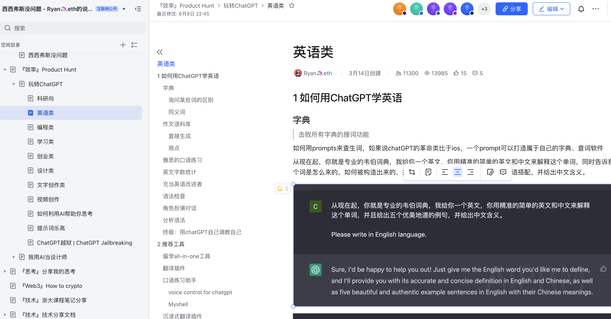

# awesome-ChatGPT-prompts

本文是一篇浏览量已经突破10万的ChatGPT使用指南。欢迎给我一个Star💫

本文的链接如下[‌⁢‍‍⁢⁡⁡⁣⁤‬⁢⁤⁢⁣⁢‌⁢‬⁡‬⁢⁣‍‬⁤‬‬⁣⁣⁤⁢‌‬⁤玩转ChatGPT - 飞书云文档 (feishu.cn)](https://k5ms77k0o1.feishu.cn/wiki/wikcnJyI9wsyjyBc8xiDgv0cY8b)

本文将为您介绍如何玩转ChatGPT，从最基本的使用方法到高级的提示工具和AI应用。如果您是第一次接触GPT，这篇文档将为您提供全面的指导，即使您没有科学上网的条件，也能轻松使用ChatGPT。

在本文中，您将会了解到系统性的Prompts engineering方法论，来引导AI生成符合特定需求的文本的方法。我们也会根据不同的场景，为您总结好用的提示词和AI工具，这些场景包括科研、学英语、学习、编程、创业、文字创作等。

除此之外，本文还包含了一些有趣的AI玩具，以及一些通用的好用的提示词，

本文将按照以下目录展开：

1. 简单拆解GPT，如何使用上GPT
2. Prompts engineering方法论，提示词框架
3. 不同场景下的好用提示词和AI工具
4. AI赛博玩具
5. 玩转ChatGPT的一些玩法
6. Prompts相关网站
7. GPT开发指南
8. 感谢/延展阅读

# 注明

因为不希望文档被下载复制被不良商贩贩卖，所以没有开放复制、下载权限，但是对于使用提示词来说，体验非常差，如果有复制提示词的需求，可以尝试使用OCR工具进行复制。

# Star History

## Star History

